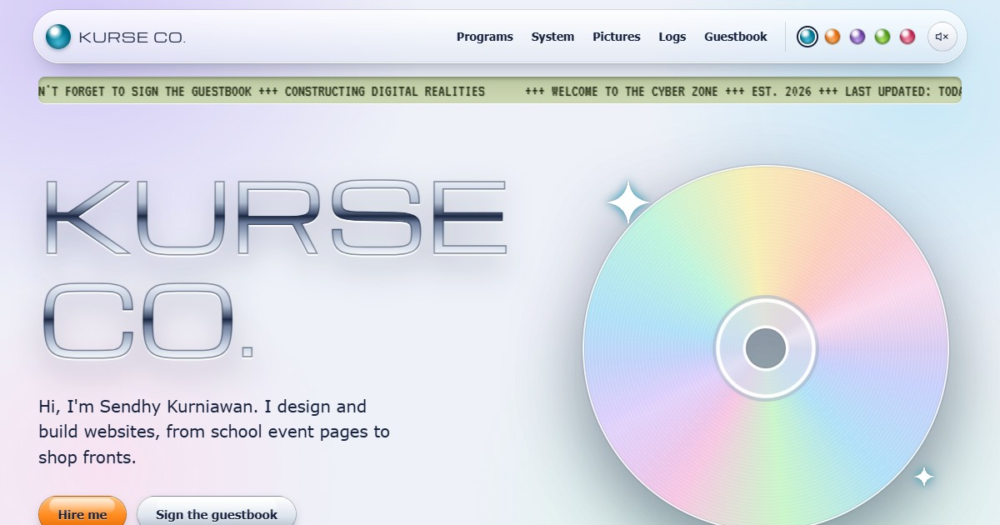

# Portfolio — KURSE CO. Millennium Edition

The personal portfolio of [Sendhy Kurniawan](https://github.com/SendhyKurniawan): a Y2K-styled site
built with plain PHP and MySQL, no framework. Frosted plastic windows, liquid chrome type, an LCD
hit counter, and a guestbook that works like a 2001 instant messenger.



## What's in it

- **Programs** — the sites I've designed and built, each in its own window with its stack and a
  screenshot. Anything added in the last 60 days gets a "NEW!" sticker.
- **System Properties** — a tabbed dialog listing what's installed: skills collected automatically
  from every project's tech stack, and my course certificates.
- **My Pictures** — anime edits and photo manipulations, read straight from the image folders and
  opened in a picture viewer with Previous/Next and arrow keys.
- **System logs** — short posts, shown as an inbox and read in a modal.
- **Guestbook** — leave a message; it stays private until I approve it, then it joins the public
  chat window. Email addresses never reach the page.
- **Admin panel** — password-protected CRUD for projects, posts and guestbook approvals.
- **Details worth finding** — five iMac colour flavours, optional Web Audio interface sounds, a
  bouncing-logo screensaver after a minute idle, a blue-screen 404, and a Konami code
  (↑ ↑ ↓ ↓ ← → ← → B A) that turns the whole site back into 1999.

Everything respects `prefers-reduced-motion` and works down to 390px wide. Pages are rendered on
the server, so the content is there before any script runs.

## Stack

| | |
|---|---|
| Language | PHP 8.2, no framework |
| Database | MySQL 8 via PDO |
| Front end | Vanilla CSS and JavaScript, Bootstrap 5 for the grid and modals |
| Dev tooling | Docker Compose, Composer (dev-only), PHPUnit 11 |

## Running it locally

You need Docker and Docker Compose.

```bash
cp .env.example .env      # then fill it in — Compose refuses to start without it
docker compose up -d --build
```

The site is on <http://localhost:8095>; MySQL is published on `127.0.0.1:3388`.

`.env` holds the database credentials and the admin login. Generate the password hash with:

```bash
php -r "echo password_hash('your-password', PASSWORD_DEFAULT), PHP_EOL;"
```

`database/init.sql` seeds the schema the first time the database volume is created. To start over:

```bash
docker compose down -v
```

Sign in to the admin panel at <http://localhost:8095/admin/login.php>.

## Tests

```bash
composer install
vendor/bin/phpunit                              # unit tests for lib/
SMOKE_ADMIN_PASSWORD=... php tests/smoke.php    # HTTP test against the running stack
```

The unit tests cover validation, CSRF and escaping, uploads, throttling, the guestbook, the
visitor counter, the skills list and the gallery. The smoke test drives the real site over HTTP:
it checks the security headers, that private paths stay private, that uploads can't smuggle PHP,
that the login locks out after five bad attempts, and that an unapproved guestbook message never
appears in public. It creates its own rows and cleans them up.

## Layout

```
index.php          public page          lib/        shared helpers (loaded via lib/app.php)
404.php            blue-screen 404      config/     PDO connection from environment variables
admin/             admin panel          database/   schema and migrations
css/  script/      styles and JS        docker/     Apache and PHP configuration
img/  uploads/     images               tests/      unit tests and the smoke test
```

## Security

The project root is the web root, so the server does the fencing:

- Apache denies dotfiles and the `config/ lib/ database/ docker/ tests/ vendor/` directories, plus
  `.sql`, `.md`, `.yml`, `.json` and similar files. Every rule is case-insensitive, because bind
  mounts from Windows and macOS are.
- PHP never executes inside `uploads/`. Uploaded images are MIME-sniffed and stored under random
  names.
- Output is escaped at the point of printing; input is stored raw.
- Every state-changing form carries a CSRF token, and logins, guestbook posts and uploads are
  rate-limited per IP.
- Credentials live only in `.env`, which is not in the repository.

## Credits

Designed and built by [Sendhy Kurniawan](https://www.instagram.com/kurniawansendhy/).
The first version of this site was inspired by [vanholtz.co](https://vanholtz.co/); the current
Millennium Edition design is its own thing.
